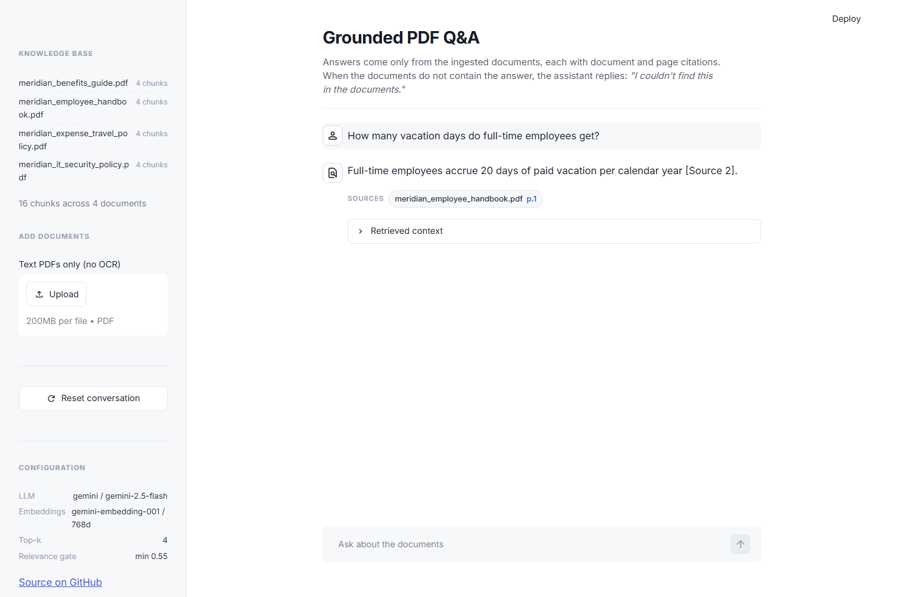
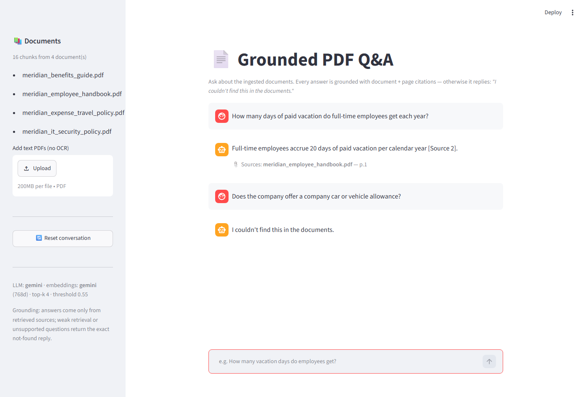

# 📄 Grounded RAG PDF Q&A

A small, production-quality **Retrieval-Augmented Generation** chatbot that answers questions
**only** from your PDF documents — with **document + page citations** on every answer and a hard
guardrail: if the answer isn't in the documents, it replies exactly

> **"I couldn't find this in the documents."**

Built on a **100% free stack** (Google Gemini free tier + Chroma + Streamlit), fully
**provider-agnostic**: switch to OpenAI with one env var.

**🚀 Live demo: <https://rag-pdf-7.streamlit.app>** — hosted free on Streamlit Community
Cloud; the first load after idle can take a few seconds. Live-deployment proof shots:
[grounded](screenshots/03_live_grounded.png) · [not-found](screenshots/04_live_not_found.png).

| Grounded answer with citation | Out-of-docs question → exact refusal |
|---|---|
|  |  |

---

## Why this demo is interesting (not just another RAG tutorial)

1. **No-hallucination contract, enforced in three layers** (see below) — including *hard
   negatives* like asking about a "vehicle allowance" when the docs only mention per-mile
   mileage reimbursement. The model must refuse, and the eval proves it does.
2. **Citations that can't lie**: the model can only cite numbered sources it was actually
   given; markers are parsed back into `{document, page}` pairs server-side.
3. **Evaluated, not vibed**: a 17-question golden set (12 grounded + 5 adversarial
   not-found) runs against the live pipeline and prints a pass/fail table. Current result:
   **17/17**, including all refusals matching the contract string *verbatim*.
4. **Tuned on evidence**: chunk size and the relevance threshold were chosen from a measured
   experiment (documented in [progress.md](progress.md)), not defaults.

---

## Architecture

```text
            ┌────────────────────── app.py (Streamlit) ──────────────────────┐
            │ chat · history · PDF upload · reset · citations · context view │
            └──────────────┬────────────────────────────────┬────────────────┘
                           │ ask(question)                  │ ingest(files)
                           ▼                                ▼
  rag/qa.py ── answer() ──────────────────────    rag/ingest.py
  1 embed query          (RETRIEVAL_QUERY)        extract_pages(pdf) → [(page, text)]
  2 Chroma top-k → relevance = 1 − distance       chunk per page → {doc, page, idx}
  3 GATE 1  best < THRESHOLD ─────► NOT FOUND              │
  4 build numbered [Source i] context                      ▼
  5 grounded generation (strict system prompt)    rag/vectorstore.py (Chroma·cosine)
  6 GATE 2+3  model refusal → exact string        add · query · idempotent per doc
  7 parse [Source i] → citations {doc, page}               │
                           │                               │
                           ▼                               ▼
  rag/llm.py — ONE interface, provider chosen by env (rag/config.py)
     ├─ gemini : gemini-2.5-flash + gemini-embedding-001 (768d, L2-norm)  ← FREE default
     ├─ openai : gpt-4o-mini + text-embedding-3-small (1536d)             ← client-ready
     └─ local  : sentence-transformers MiniLM (384d, embeddings-only fallback)
```

### How the grounding guardrail works

| Layer | Mechanism | Catches |
|---|---|---|
| **Gate 1 — retrieval threshold** | best chunk relevance (`1 − cosine distance`) `< 0.55` → return the exact refusal **without calling the LLM** | off-topic questions ("how do I cook rice?") — deterministic, free, unit-tested with a chat stub that *fails the test if invoked* |
| **Gate 2 — grounded prompt** | model may answer **only** from numbered sources; explicit rule: *"a source mentioning the topic is NOT the same as answering the question"* | hard negatives — related chunks retrieved, but no actual answer (vehicle allowance vs. mileage; stock options vs. 401(k) vesting) |
| **Gate 3 — normalization** | any refusal-shaped reply is normalized to the exact contract string | minor model drift ("…documents" without the period) |

Citations: retrieved chunks are presented as `[Source 1] (document: X.pdf, page: N)`; the model
cites inline; `parse_citations()` maps markers back to real `{document, page}` pairs (out-of-range
markers are discarded — the model cannot invent a source it wasn't shown).

---

## Eval results (live pipeline, Gemini free tier)

`python eval/eval.py` — actual output:

```text
eval config: llm=gemini embeddings=gemini/768d threshold=0.55 chunks=400/60 top_k=4 | store: 16 chunks

id                   type       result  detail
-----------------------------------------------------------------------------------------------------------
vacation-days        grounded   PASS    'Full-time employees accrue 20 days of paid vacation per ca' -> meridian_employee_handbook.pdf p.1
core-hours           grounded   PASS    'Meridian Labs observes core working hours of 10:00 AM to 4' -> meridian_employee_handbook.pdf p.1
remote-days          grounded   PASS    'Employees may work remotely up to 3 days per week [Source ' -> meridian_employee_handbook.pdf p.2
password-length      grounded   PASS    'All account passwords must be at least 14 characters long ' -> meridian_it_security_policy.pdf p.1
password-rotation    grounded   PASS    'Passwords must be rotated every 180 days [Source 1].' -> meridian_it_security_policy.pdf p.1
incident-reporting   grounded   PASS    'Suspected security incidents must be reported to the secur' -> meridian_it_security_policy.pdf p.2
data-tiers           grounded   PASS    'Company data is classified into four tiers: Public, Intern' -> meridian_it_security_policy.pdf p.2
meal-limit           grounded   PASS    'Employees are reimbursed for business meals up to a limit ' -> meridian_expense_travel_policy.pdf p.1
expense-approval     grounded   PASS    'Any single expense greater than $1,000 requires prior writ' -> meridian_expense_travel_policy.pdf p.1
401k-match           grounded   PASS    'The company matches 401(k) contributions dollar-for-dollar' -> meridian_benefits_guide.pdf p.1
parental-leave       grounded   PASS    'Meridian Labs provides 16 weeks of fully paid parental lea' -> meridian_benefits_guide.pdf p.2
wellness-stipend     grounded   PASS    'The annual wellness stipend amount is $500 [Source 1].' -> meridian_benefits_guide.pdf p.2
vehicle-allowance    not_found  PASS    exact refusal (stage=model)
pet-insurance        not_found  PASS    exact refusal (stage=model)
stock-options        not_found  PASS    exact refusal (stage=model)
contractor-vacation  not_found  PASS    exact refusal (stage=model)
off-topic-cooking    not_found  PASS    exact refusal (stage=retrieval)
-----------------------------------------------------------------------------------------------------------
17/17 passed  (5/5 not-found cases exact)
```

The five `not_found` rows are the guardrail proof: four **hard negatives** refused by the
grounded model (`stage=model`) and one off-topic question stopped by the deterministic
retrieval gate (`stage=retrieval`) without an LLM call. `stock-options` is the nastiest case —
the docs *do* discuss vesting (401(k) matching), and the model correctly refuses anyway.

Tests (offline, deterministic, no API keys needed): `pytest -q` → **15 passed** — chunking
metadata preservation, retrieval mechanics, threshold routing (proven LLM-free), refusal
normalization, citation parsing/dedup.

---

## Quickstart (local, Windows/macOS/Linux)

```bash
git clone https://github.com/Nadercr7/rag-pdf-qa && cd rag-pdf-qa

python -m venv .venv                       # Python 3.11+
.venv\Scripts\activate                     # Windows   (macOS/Linux: source .venv/bin/activate)
pip install -r requirements.txt

copy .env.example .env                     # then put your key(s) in .env
#   GEMINI_API_KEY=...            (one key)          — free at aistudio.google.com/apikey
#   GEMINI_API_KEYS=k1,k2,...     (several keys → automatic rotation on free-tier rate limits)

python scripts/make_sample_pdfs.py         # generate + self-verify the sample corpus
python scripts/ingest_cli.py               # chunk + embed + store (idempotent)
streamlit run app.py                       # chat at http://localhost:8501

pytest -q                                  # offline tests
python eval/eval.py                        # live golden-set eval (uses your key)
```

## Switching providers

One interface (`rag/llm.py`), selected entirely by env vars — no code changes:

| Setup | .env |
|---|---|
| **Gemini (free, default)** | `LLM_PROVIDER=gemini` + `GEMINI_API_KEY(S)=...` |
| **OpenAI** (the production target) | `LLM_PROVIDER=openai` + `OPENAI_API_KEY=sk-...` |
| Hosted LLM, **zero-cost local embeddings** | add `EMBEDDING_PROVIDER=local` (+ `pip install -r requirements-local.txt`) |

Embedding spaces are namespaced per provider+dimension (`pdfs_gemini_768`, `pdfs_openai_1536`, …)
so switching providers can never mix incompatible vectors; re-ingest after switching.
Models are also overridable (`GEMINI_CHAT_MODEL`, `OPENAI_CHAT_MODEL`, …) — see
[.env.example](.env.example) for every knob.

## Project layout

```text
app.py                     Streamlit chat UI
rag/config.py              env + provider switch + NOT_FOUND_MESSAGE contract
rag/llm.py                 Embeddings/ChatModel interfaces · Gemini (key rotation) · OpenAI · local
rag/ingest.py              PDF → per-page chunks {document_name, page_number, chunk_index}
rag/vectorstore.py         Chroma (cosine, persistent, idempotent, explicit vectors)
rag/qa.py                  retrieve → gates → grounded prompt → citations
scripts/make_sample_pdfs.py  generates the fictional "Meridian Labs" corpus (self-verifying)
scripts/ingest_cli.py        CLI ingestion
eval/golden.yaml · eval.py   golden Q&A + pass/fail runner
tests/                       offline deterministic suite (fake providers)
sample_pdfs/ · screenshots/ · SPEC.md · PLAN.md · progress.md · DEPLOY.md
```

## Design notes & limitations (deliberate MVP scope)

- **Text PDFs only** — no OCR; scanned documents are out of scope.
- **Free-tier throughput**: Gemini free tier is ~10 req/min per key; the client rotates across
  `GEMINI_API_KEYS` and retries transient errors. For public traffic, add keys or go local
  embeddings.
- The demo host's vector store is shared and ephemeral (container restarts re-seed the sample
  corpus automatically).
- Not built (on purpose): auth, databases, queues, reranking, token streaming, conversational
  memory. The corpus is fictional ("Meridian Labs") and generated by
  [scripts/make_sample_pdfs.py](scripts/make_sample_pdfs.py).

## License

MIT — see [LICENSE](LICENSE).
